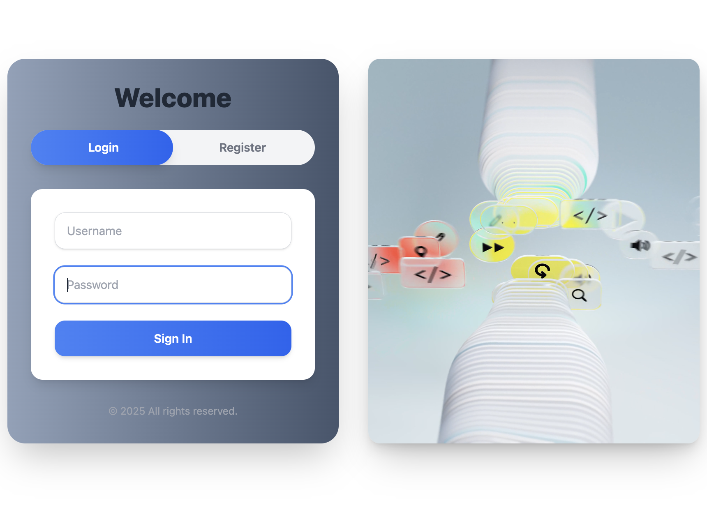
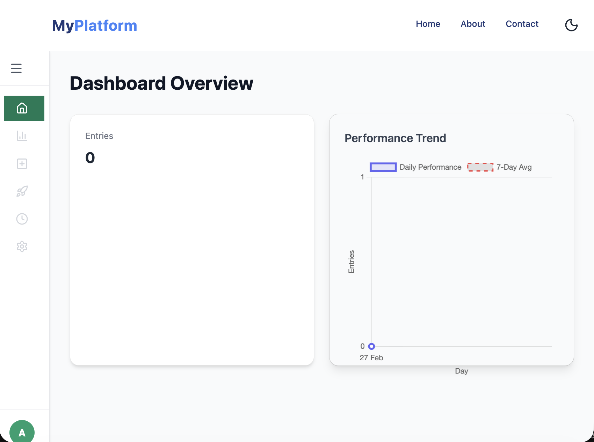

# AI-Based Personal Dashboard

## Overview
This project is an AI-based personal dashboard that integrates both frontend and backend components. It is designed to provide users with a seamless experience for managing their personal data and tasks effectively.
---

---

---
## Features
- **User Authentication:** Secure login and registration process.
- **Data Visualization:** Interactive charts and graphs to represent users' data.
- **Intelligent Suggestions:** AI algorithms provide personalized recommendations based on user behavior and preferences.
- **Task Management:** Users can add, edit, and delete tasks with reminders.
- **Responsive Design:** Ensures a smooth experience across devices.

## Technologies Used
- **Frontend:** React.js, Bootstrap
- **Backend:** Node.js, Express.js, MongoDB
- **AI:** Python for implementing AI algorithms.

## Installation
1. Clone the repository:
   ```bash
   git clone https://github.com/CodeByAfroj/AiBasedPersonalDashBoard.git
   ```
2. Navigate to the backend folder and install dependencies:
   ```bash
   cd AiBasedPersonalDashBoard/backend
   npm install
   ```
3. Navigate to the frontend folder and install dependencies:
   ```bash
   cd ../frontend
   npm install
   ```
4. Set up your environment variables and run the application:
   ```bash
   npm start
   ```

## Usage
- Access the application through your web browser.
- Register or log in to start using the dashboard.

## Contribution
Contributions are welcome! Please open an issue or submit a pull request to propose changes.

## License
This project is licensed under the MIT License.

## Author
**CodeByAfroj**  
*Date: 2026-02-27*  
*Contact: <your_email@example.com>*  

---  
This README was created to provide a professional overview of the AI-based personal dashboard project.
